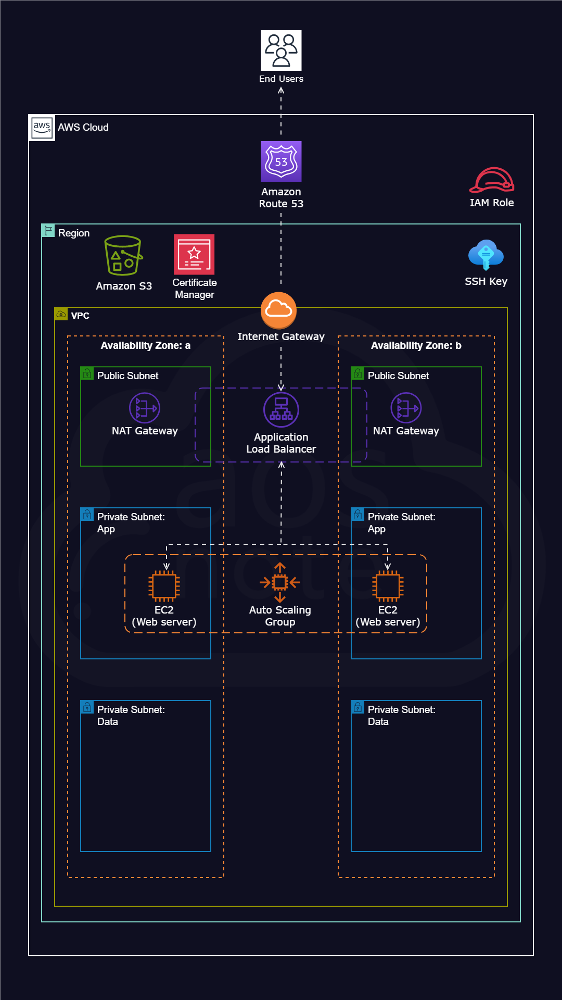

# Host a Static Website on AWS (EC2 + ALB + Auto Scaling + Route53)

## Overview

The system is designed using **private subnets, load balancing, auto scaling, and HTTPS enforcement**, ensuring fault tolerance, scalability, and secure access.


## Architecture


## Architecture Breakdown

### 1. Networking (VPC Design)
- Created a custom VPC with CIDR block
- Configured **public and private subnets across multiple Availability Zones**
- Public subnet used for:
  - Application Load Balancer
  - NAT Gateway
- Private subnet used for:
  - EC2 web servers (no direct internet access)


### 2. Secure Access Design
- Implemented security groups:
  - ALB → allows HTTP (80) & HTTPS (443) from internet
  - EC2 → allows traffic **only from ALB**
- EC2 instances are not publicly accessible
- Bastion host used for SSH access


### 3. Compute Layer (EC2 + Apache)
- Deployed EC2 instances using Amazon Linux
- Installed Apache web server
- Application files deployed to: `/var/www/html`


### 4. Deployment Strategy
Used user-data script to automate setup:

```bash
#!/bin/bash

# Create environment variables
export S3_URI="s3://dev-app-webfiles-rd/jupiter/jupiter.zip"
export APPLICATION_CODE_FILE_NAME="jupiter"

# Update the packages on the EC2 instance
sudo yum update -y

# Install the Apache HTTP Server
sudo yum install -y httpd

# Change to the Apache web root directory
cd /var/www/html

# Remove any existing files
sudo rm -rf *

# Download the zip file from the S3 bucket
sudo aws s3 cp "${S3_URI}" .

# Unzip the downloaded file
sudo unzip "${APPLICATION_CODE_FILE_NAME}.zip"

# Copy the contents to the html directory
sudo cp -R "${APPLICATION_CODE_FILE_NAME}/." .

# Clean up zip file and extracted folder
sudo rm -rf "${APPLICATION_CODE_FILE_NAME}" "${APPLICATION_CODE_FILE_NAME}.zip"

# Enable Apache to run on boot
sudo systemctl enable httpd

# Start Apache service
sudo systemctl start httpd

```
### 5. Load Balancing (ALB + Target Group)
- Configured Application Load Balancer in public subnet
- Created Target Group for EC2 instances
- Enabled health checks with success codes:
   - 200 (OK)
   - 301/302 (redirects)

- Ensures traffic is only sent to healthy instances

### 6. HTTPS & Security (ACM + Listener Rules)
 - Requested SSL certificate using AWS Certificate Manager
 - Attached the certificate to ALB
 - Configured:
    - HTTP listener (port 80) → redirect to HTTPS
    - HTTPS listener (port 443)

 - Implements SSL termination at ALB

### 7. Auto Scaling (High Availability + Fault Tolerance)
 - Created Launch Template (dev-lt)
 - Created Auto Scaling Group (dev-asg)
 - Scaling Policy:
      - Scale Out: CPU > 70%
      - Scale In: CPU < 30%
 - Capacity:
      - Min: 1
      - Desired: 2
      - Max: 5

 - Ensures:
     - Automatic scaling based on demand
     - Self-healing when instances fail

### 8. Fault Tolerance (Self-Healing)
 - If EC2 instance is terminated:
   - Auto Scaling detects failure
   - New instance is launched automatically using Launch Template

### 9. DNS & Domain Routing (Route53)
- Registered domain using Route53
- Created A (Alias) record pointing to ALB


### Key Features
- Used private subnets to isolate backend servers
- Implemented ALB instead of direct EC2 exposure
- Used health checks (200, 301, 302) to handle redirects correctly
- Implemented HTTP → HTTPS redirection
- Used Auto Scaling for both scalability and self-healing
- Centralized SSL handling at ALB instead of EC2

### Testing Performed
- Verified ALB routing to EC2 instances
- Simulated instance failure → Auto Scaling replaced instance
- Verified HTTP → HTTPS redirection
- Tested health checks behavior with redirects

### System Capabilities
- High availability across multiple AZs
- Secure architecture using private subnets
- Auto scaling based on load
- Fault tolerance with self-healing
- HTTPS-enabled application
- Load-balanced traffic distribution


This project demonstrates the design of a secure and scalable AWS architecture by combining networking, compute, and load balancing services into a cohesive system.

Through this implementation, I explored key cloud engineering concepts such as:
- isolating resources using private subnets
- distributing traffic using an Application Load Balancer
- handling failures using Auto Scaling (self-healing)
- enforcing secure communication with HTTPS

The architecture is designed to be production-ready, with a focus on high availability, fault tolerance, and security best practices.
